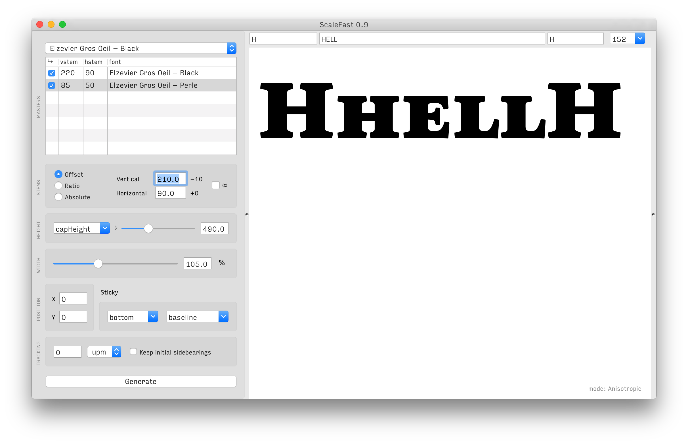
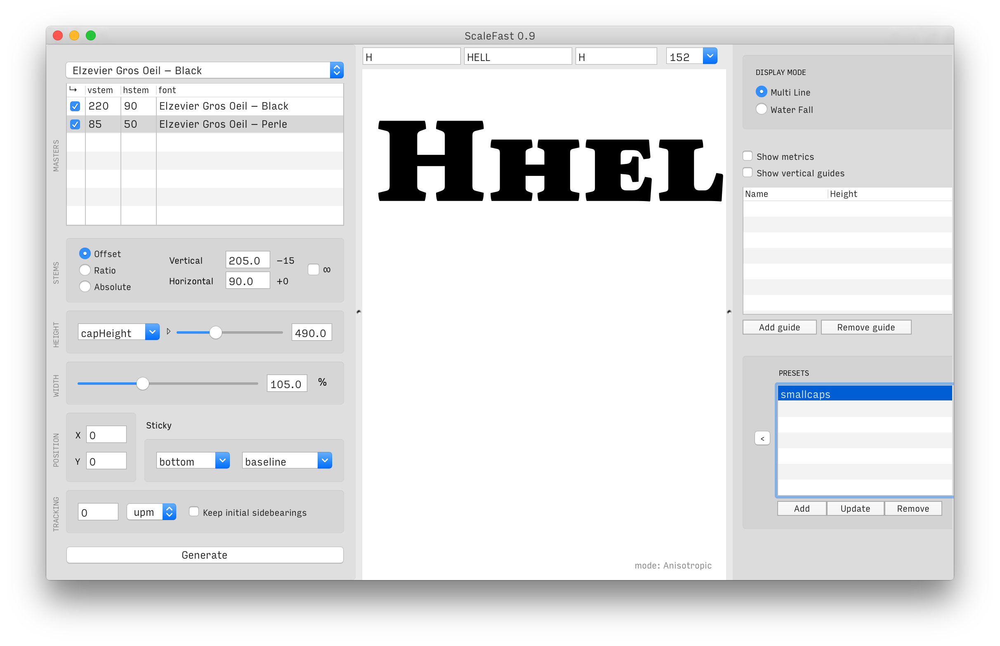
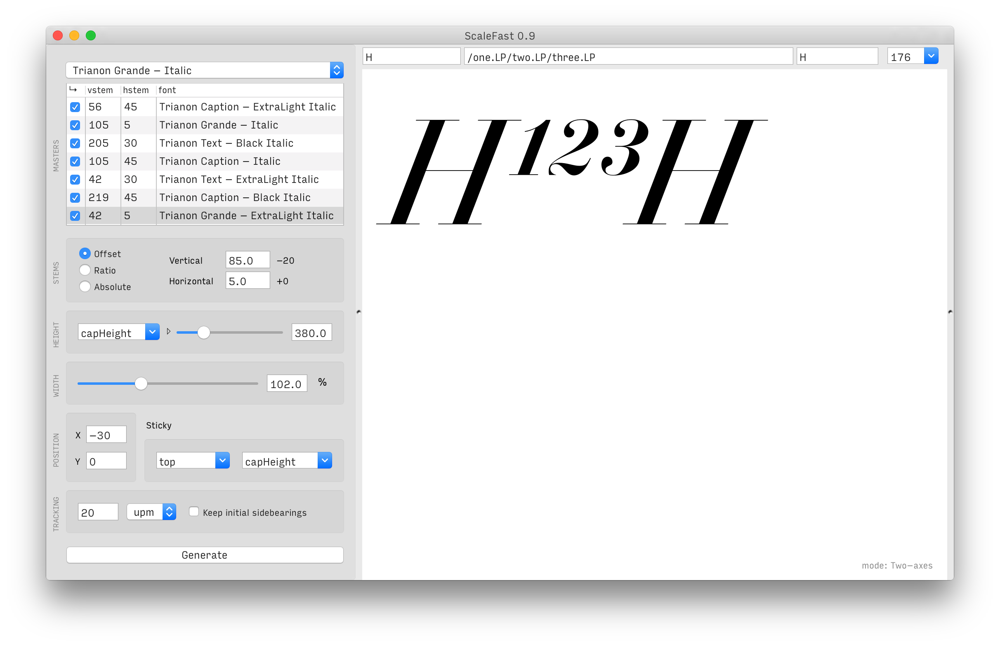
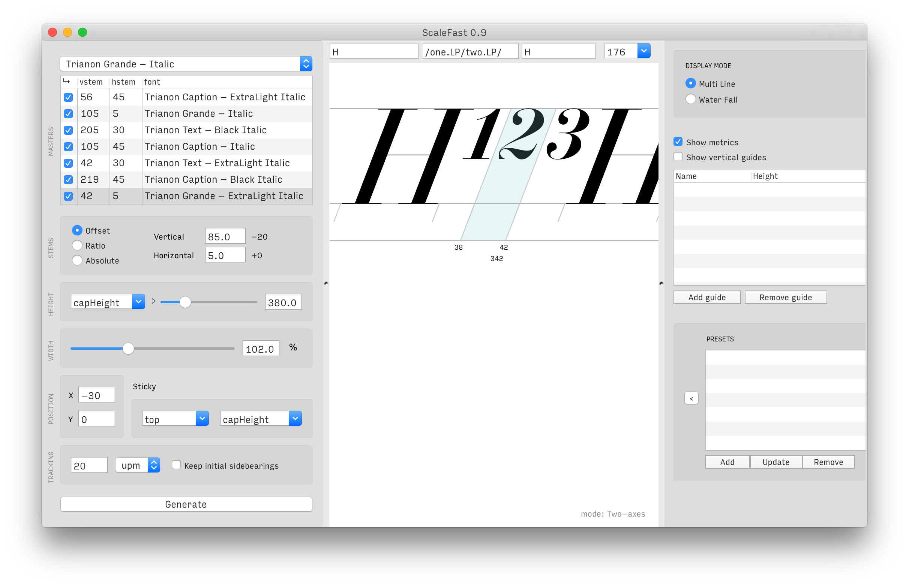
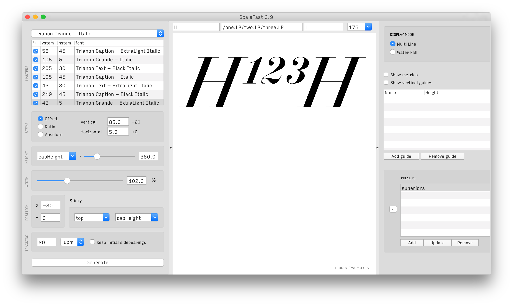
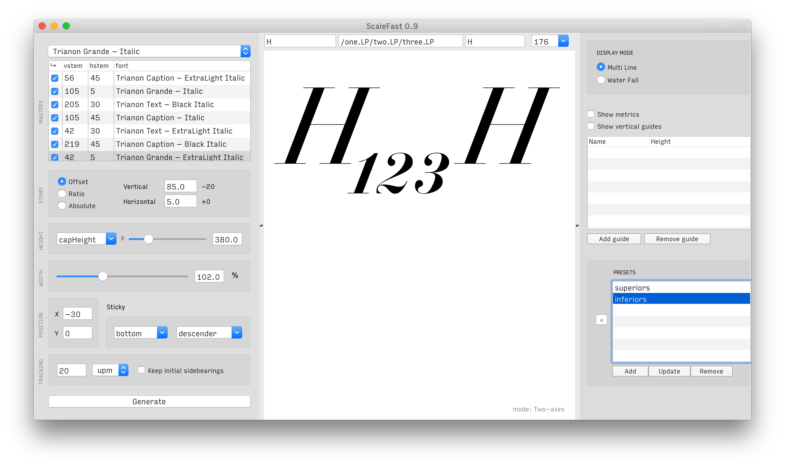
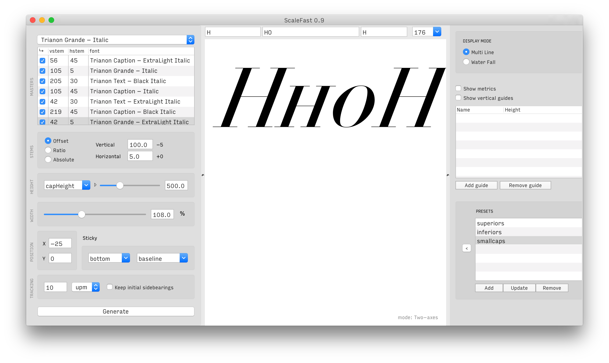
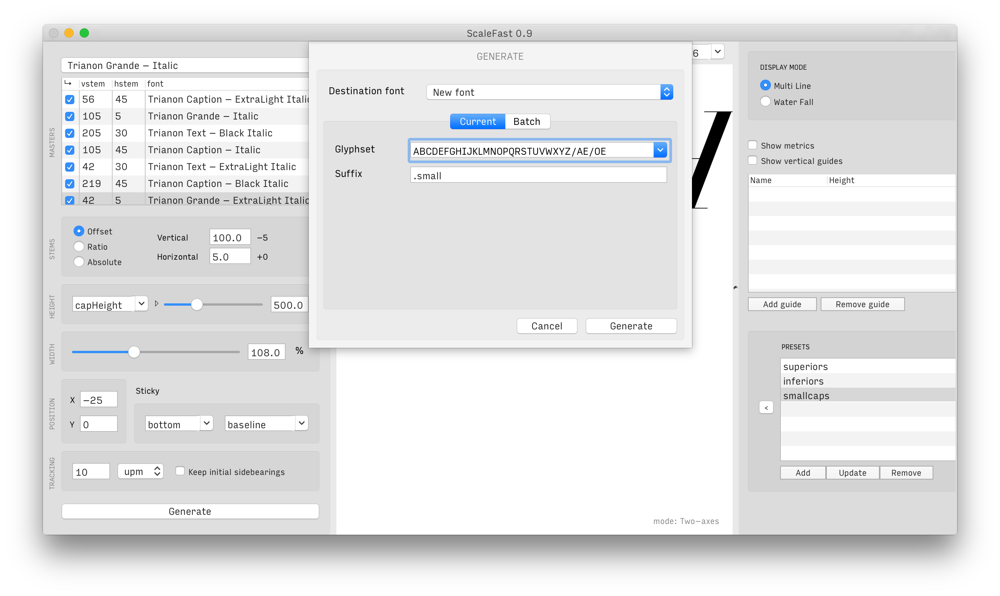
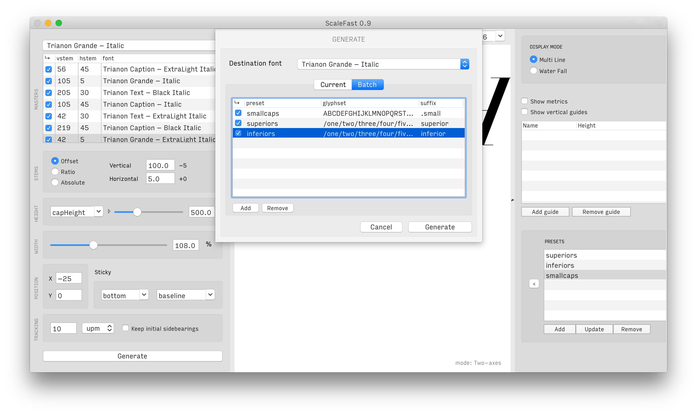

ScaleFast
=========

This extension’s mission is simple: keep stem widths consistent while you fiddle with proportions of a glyph. It manages that by trying to compensate for scale deformations through interpolation. To achieve this result, it requires at least two masters (a regular and a bold for instance). This way, you can easily produce scaled versions of existing glyph for any purpose you see fit, small capitals, superiors, extended or condensed styles, etc.
Any transformation you input can be saved as a preset for a later use. Presets are stored inside the ufo file of the selected working font (among masters).

*The tool’s flexibility comes a great deal from its relying on [MutatorMath](https://github.com/LettError/MutatorMath), written by Erik van Blokland.*

## Table of Contents

- [How it works](#how-it-works)
- [Scaling](#scaling)
    - [Stems](#stems)
    - [Modes](#modes)
    - [Presets](#presets)
    - [Guides](#guides)
- [Transformations](#transformations)
    - [Offset](#offset)
    - [Sticky](#sticky)
    - [Tracking](#tracking)
- [Generating](#generating)
    - [Current](#current)
    - [Batch](#batch)

## How it works

To get the best possible results, here are a few explanations about how this extension works.

The scaling is handled by a [scaling engine](https://github.com/loicsander/MutatorScale). When provided with fonts as masters, the scaling engine uses interpolation to scale glyphs according to settings defined by the user. In ScaleFast, adding or removing masters to the scaling engine is done by checking/unchecking the available fonts in the masters list.

When you add masters (as many as you like), they are analyzed for vertical & horizontal stem width (based on capital I’s stem and the horizontal bar of H). These values are then used as reference points to build an interpolation space (with help of MutatorMath). If you don’t wish to work with stem values, you can replace them and work with units on any scale you like (0 to 1000 for instance). You should note however that this tool is built to work with stem widths, so if you work outside of this scheme, the script will work fine, but the experience won’t be as smooth.

## Scaling

With ScaleFast, what you scale firstly are reference heights. This is why you’ll find a slider and text input requiring a value in units (per em) and a popup menu with predefined reference heights. What you’re asking for when you input [xHeight]>[300] is effectively that ScaleFast reduces glyphs with a ratio of 300/500, if the xHeight is 500 units high, for instance. The ratio part is taken care of, all you need to know is the change in dimensions you want. This specific input used as an example will result in lowercase letters having a 300 units high xHeight themselves.

### Stems

As I mentioned earlier, the whole point of ScaleFast is allowing you to scale glyphs while defining the exact stem width (be it vertical or horizontal) you wish to obtain on the scaled glyphs. This being, be aware that scaled glyphs go through quite a lot of mathematical operations and rounding, so don’t be surprised if the results display some little inaccuracies (shouldn’t be beyond 2 or 3 units though).
The way you define stem values depends on the mode you’re working with.

### Modes

ScaleFast can work according to three modes, the default being isotropic.

**Isotropic**

This is the simplest interpolation, one that moves values linearly between two reference points, or masters. With this mode, the script will only be able to retain vertical stem width while you scale glyphs; which is not so bad to begin with. This means that serif thickness, for instance, will be smaller than the original size. With this mode, you can only define vertical stem values, which will define the interpolation factor between master stem values. If the masters stem values are accurate, the result will be as well. Only vertical stem width will be correct though.

**Anisotropic**

The anisotropic mode distinguishes interpolation on the X and Y axes. It provides the possibility of deformation along each of those two axes. Practically, it means that — to a certain extent — the script can compensate for reduction on the Y axis also and try to maintain horizontal stem width as well. Depending on the design, you might luckily not need to correct serif thickness or contrast. This mode requires two values for vertical and horizontal stems, with that and to the best of its capabilities, the tool will try to maintain these values for the stems of the scaled glyphs. Be aware that the result will strongly depend on your design, if you spot inconsistencies in size among the generated glyphs, please start by checking that these aren’t due to your masters’ stem widths.

**Bi-dimensional**

Being able to work in two-dimensional interpolation was the actual reason that pushed me to write this tool. Thanks to MutatorMath, handling interpolation along multiple axis has become incredibly easy, and it’s also incredibly powerful. The best use case (and the one I initially wrote this tool for) is the case of a contrasted type family with optical sizes. For type of which the weight evolves in the ‘usual’ way — that is to say relative contrast lessens while weight becomes heavier, effectively making horizontal stems thicker — working with isotropic or anisotropic interpolation will probably be sufficient to generate scaled glyphs that require little or no correction.

But in the case of a family in which the thickness thin parts (serifs for instance) do not change with weight (random example: a Didot face), anisotropic interpolation can’t compensate anything because there’s no difference in contrast to work from. But if you have been working with optical sizes and your optical sizes are compatible for interpolation, then you do have a difference in contrast that can be put to good use. This situation allows you to work both with separate weight & contrast axes, and in that case you can use bi-dimensional interpolation to solve your scaling problems. To be honest, you could work out an an/isotropic interpolation scheme with your optical sizes, but that would be to the expense of much time spent generating intermediary masters. Not very practical.

Now back to ScaleFast, if you provide at least three masters that allow the script to build a two axis interpolation scheme, then you can generate whatever scaled glyphs you need, and it’s actually the case in which the tool performs the best.

To be more specific, this mode requires that at least two masters both share their horizontal stem values while having different vertical stem values, and that a a least one third master has an horizontal stem value different from the two others.
But don’t bother keeping that in mind, ScaleFast figures out on its own if it has all that is required for bi-dimensional interpolation, it will switch automatically to this mode if it can.

### Presets

Any settings you define can be store as a preset (through the right hand panel). Presets are stored in the selected working font, so they will stay in the UFO unless you remove them.

### Guides

You can add custom guides that will be stored in the font and can be displayed to help with your scaling work.

## Transformations

### Offset

On top of the scaling, you can defined X/Y offsets to be applied  to all glyphs.

### Sticky

In combination with manual offsetting, there’s a helper ‘sticky’ option that allows you to define alignments for scaled glyph. If you’re working on superiors for instance and you wish to see them aligned with the capHeight, you only need to specify [top][capHeight]. Note that the second Pop-up menu will recognize any custom guide as well as the base vertical metrics of a font.

### Tracking

There are several things you can do about the spacing of the glyphs you scale. By default, the width of a scaled glyph is scaled as well. But if you’d rather avoid that, you can activate the ‘Keep inital sidebearings’ checkbox, the glyphs will be scaled but  their sidebearings will remain those of the normally sized glyphs (using the source glyph of the selected master font as reference).
On top of that — spacing being scaled or not — you can add tracking, either in percentage or units (per em). Note that if you apply tracking with percentages, you will probably get undesired results with components (because handling those is rather tricky); it will work great for glyphs containing only contours though.

## Generating

You can generate any glyph set you want. The generated glyphs can then be directly reinserted into one of the existing masters, or another open font, or a new one created for the occasion. Additionally, you can suffix the generated glyphs. Note that if you reinsert generated glyphs in a existing font without suffixing glyph names, existing glyphs with the same name in the target font will be replaced.

### Current

This generates glyphs with the current settings and provided glyphset + suffix.

### Batch

You can also generate different glyphsets by using presets to define which settings should be applied to a specific series of glyphs.

